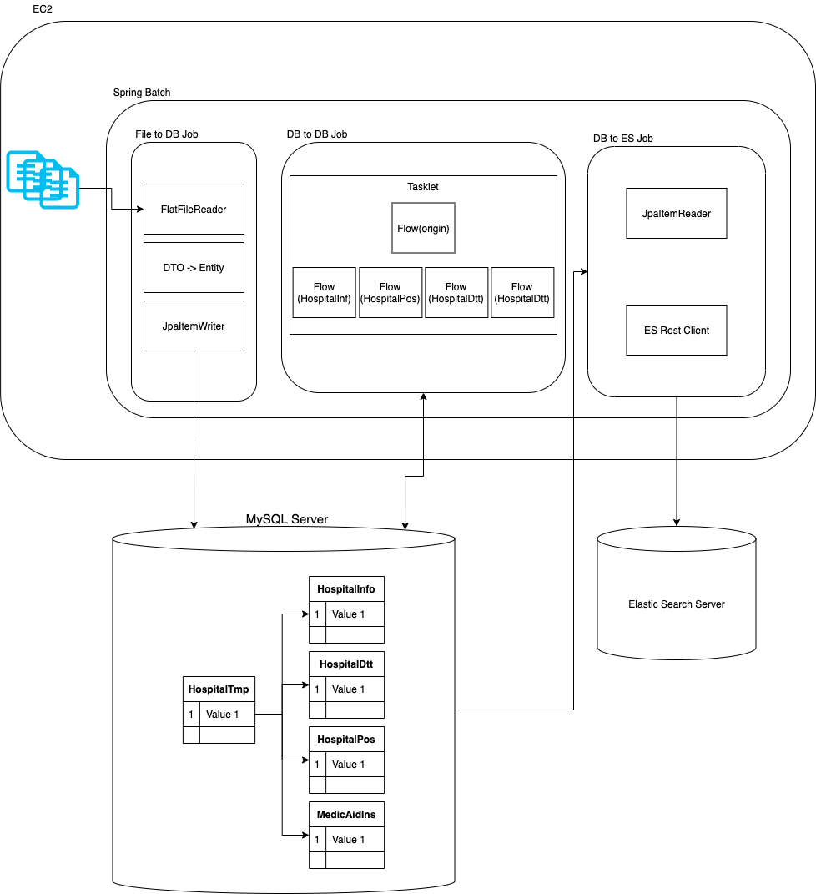

# 데이터 가공하기

## 프로세스 요구사항 개요

1. 파일 데이터를 읽어서 데이터 베이스에 저장

2. 임시 데이터베이스에 저장된 데이터를 정규화된 테이블에 저장

3. 정규화된 데이터베이스의 데이터를 가공하여 Excel 생성

### 요구사항 구현 설계

1. POJO
	- File 객체를 통해 파일을 한 줄 씩 읽어 DTO에 저장, JDBC를 통해 Database에 저장
	- DB에서 데이터의 컬럼을 그룹화하여 관련 테이블을 생성하여 해당 테이블에 저장
	- 필요한 비즈니스 쿼리를 통하여 데이터 조회 poi 라이브러리를 통해 Excel 생성
   
2. Spring Batch의 Tasklet
	- Job, Step을 통한 배치 ExecutionContext를 관리
	- Step에서 Tasklet을 통한 비즈니스 로직 작성
		- 파일을 읽는 부분은 동일
		- 읽은 데이터를 파일에 작성 할 때 Jpa 또는 JdbcBatch를 사용
	- 데이터를 그룹화 하여 관련 테이블에 저장하는 경우, 비즈니스 로직을 Tasklet에서 직접 작성하고 수행
	- Tasklet 인터페이스를 통해 다양한 구현 방식으로 Step을 나누어 상태에 대한 데이터 처리를 DB에서 확인 가능
	    - File To DB
        - DB to DB
		- DB to File

3. Spring Batch의 Chunk
	- Job, Step을 통한 배치 ExecutionContext를 관리
	- ItemReader, ItemProcessor, ItemWriter 인터페이스의 구현 클래스를 통해 확장 가능
	    - File 읽기
			- FlatFileItemReader
	    - DB 조회
	        - JdbcCursorItemReaderBuilder, JpaPagingItemReaderBuilder
		- DB Writer
			- CompositeItemWriter, JdbcBatchItemWriter, JpaBatchItemWriter
		- Excel Writer
		    - ExcelItemWriter
	
## 관련 필드 별로 그룹화된 테이블 설계


## 요구사항 구현 프로세스

> **1. 파일 데이터를 읽어 DTO에 저장**

- **전처리**
	- 데이터 호출 시 `"(double quote)`삭제 필요

- csv 파일의 필드정보를 갖는 DTO를 작성
- 해당 DTO 클래스를 `reflection`를 통해 전체 `field`명 조회하는 `getFieldNames()` 작성
- 파일에서 chunk 단위로 읽어와 저장한 `dto`의 데이터를 `entity`로 저장하는 `toEntity()` 메서드 작성

> **2. 임시 테이블을 필요한 중요 정보와 세부 정보로 구분하여 테이블관리**

- 기관 코드를 기준으로 병원 `기본정보`, `위치`, `시간`, `그 외` 필드로 분류하여 해당 테이블로 정의한다.
	- 병원기본정보: TB_HOSPITAL_INF
	- 병원위치정보: TB_HOSPITAL_POS
	- 병원시간정보: TB_HOSPITAL_DTT
	- 병원기관분류: TB_MEDIC_AID_INS

- 전체 데이터를 읽어와 여러 테이블에 저장할 때 `멀티 스레드` 또는 `병렬 처리` 방식으로 개선할 수 있는지 생각하기
	- reader, writer가 thread-safe 한지 확인
	- `multi thread`를 통해 step 작업 시 `retry` 기능을 사용할 수 없는데 그래도 되는지

- `Parallel Step` 활용한 처리 흐름 제어
	- Parallel을 이용하여 전체 병원정보를 읽어 DataShareBean이라는 ConcurrentHashMap 기반 빈에 넣는다.
	- 기본적으로 Step을 선형으로 실행하는 방식을 Flow를 이용하여 병렬로 처리하여 DB에 저장

- 배치 시간 확인
	- 실행 환경
		- 운영체제: MacBook Pro
		- 프로세서: 2 GHz 쿼드 코어 Intel Core i5
		- 메모리:  16GB
	- `Serial Step`
		- step: 3m9s272ms
	- `Parallel Step`
		- 데이터 조회
			- flow1: 967ms
		- 데이터 입력 (Parallel Process)
			- flow4: 1m11s965ms ~ 1m21s455ms
			- flow3: 1m13s480ms ~ 1m23s39ms
			- flow2: 1m15s271ms ~ 1m23s528ms
		- 최대 시간 (전체 건수 17,479)
			- 1m30s 이내

```text
데이터를 한번 읽고 여러 테이블에 써야 하는 경우 FLOW를 통해 병렬 처리를 하는 경우 시간적으로 성능에서 이점을 볼 수 있었다. 
```

> **3. 여러 테이블로 정규화된 테이블의 데이터를 ES로 등록**

- 정규화된 데이터를 Querydsl을 통하여 Q Type 클래스 생성 및 조회 쿼리 작성
- `spring-data-elasticsearch`, `elasticsearch-rest-high-level-client` 라이브러리를 이용한 bulk API 호출로 시간을 줄여야 함
- 위 `high-level-client`라이브러리 사용시 배치가 종료가 안되는 문제점이 있음
- `spring-data-elasticsearch` 라이브러리 등록시 jpa 라이브러리와 충돌 문제 있음
- 임시로 `ClosableHttpClient`를 사용하여 curl 요청, 입력 시간차이가 어마어마함 안쓰는 것만 못함


## 코드레벨 전체 아키텍처

- 특정 작업에 대한 `Job` Prototype 클래스 작성 후 `Step`으로 리펙토링
- 구현 방식 & 속도를 생각하면서 다양하게 구현할 것
- Entity 설계 시 `@Embedded` 필드 생성 생각하기
- [enum 타입 적용하기](enum.md)
	- 테이블 마다 공통으로 사용하는 필드가 존재하는지?
	- 코드 변경하는 일이 빈번하지 않은 값
	- 단순 코드 테이블을 꼭 테이블에 가지고 있어야 하는지?
	- 그게 아닌 경우 `enum`으로 적용하기
- 복잡한 비즈니스 로직에 대한 쿼리는 Querydsl로 작성하되 Custom 클래스를 따로 작성
- ES에 데이터 등록용 DTO 작성, ES 어노테이션을 통한 데이터 명세화



## 개선 사항

- 배치 bulk 프로세스
	- 속도 개선(Single Table Insert)
		- 상황
			- 파일을 읽는 속도는 FlatFileItemReader와 일반 BufferedReader 와의 속도차이는 미미
			- 파일을 쓰는 속도에서 차이가 발생하고 줄일 수 있는 것을 확인
			- 데이터의 PK가 이미 존재하기 때문에 `@GeneratedValue`를 사용하지 않는 상황
		- jpaItemWriter
			- 작동 방식
				- JpaItemWriter를 통한 `write()` 작업이 `merge()`를 기본 Mode로 구현
				- `usePersist(true)` 의 설정이 없는 경우 `merge()` 작동 방식으로 인하여 select(id 채번) -> insert(data 입력)로 수행
				- `usePersist(true)`이 설정되어 있는 경우 `persist()`로 작동하여 `select`를 생략, 바로 `insert()` 처리
				- `persist()`로 사용하는 경우 새로운 객체를 저장할 때만 사용해야함
			- 단점
				- 기본적으로 bulk insert를 수행하지 못함
				- auto-increment가 아닌 경우 batch insert 사용 가능

		- JdbcItemWriter
			- 연관관계가 들어가면 insert가 필요한 경우 직접 구현해야 하는 부분이 너무 많음
			- 컴파일체크, 타입, SQL 쿼리 문자열 문제 발생 가능
			- 속도가 비교적 빠름

		- Jdbc & Jpa (연관관계 작성시 해당 방법으로 처리예정)
			- OneToMany 연관관계 조회하는 경우, 부모 Entity를 조회하여 PK값을 저장
			- 부모 ID값으로 자식 Entity를 JdbcItemWriter로 batch insert 처리

	- [참고](https://jojoldu.tistory.com/507)

	- 속도 개선 2 (Multi Table Insert)
		- `Parallel Step`을 홣용한 각 테이블 별 Step 구성 및 병렬 처리

- Step 간 데이터 공유
	- StepExecution 을 사용하여 Batch Meta-data를 저장하면서 성능 이슈가 발생하여 StepExecution을 사용하지 않고 Step간 데이터 공유하는 방법
	- `싱글톤 빈`을 하나 만들어 멤버 변수에 `Map`을 두어 데이터를 공유하는 방식

	- [참고](https://wckhg89.github.io/archivers/springbatch3)
