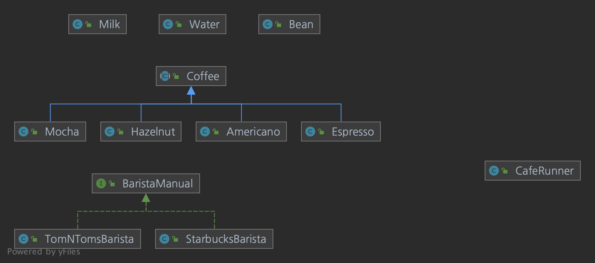

# Abstract Factory Pattern

## Intro

- 구체적인 클래스를 지정하지 않고도 관련 객체의 패밀리를 생성할 수 있는 생성 디자인 패턴

### 문제 상황

- 새로운 타입의 객체가 필요한 경우 **기존 코드를 변경하지 않고 추가**하는 것이 필요
- 빈번한 확장이 필요 하지만 핵심 코드를 수정할 수 없음

### 해결책

- **특정 카테고리**를 인터페이스로 명시적 선언하는 것이다.
- 카테고리에 따른 새로운 클래스를 필요로 하는 경우 인터페이스를 통해 구현할 수 있다.
- 모든 카테고리를 **생성**할 수 있는 목록이 있는 **인터페이스 Abstract Factory** 를 선언한다.
- **Abstract Factory 인터페이스** 를 기반으로 **구체화한 팩토리 클래스** 를 생성
- 팩토리는 특정 종류의 객체를 반환하는 클래스이다.

- 주의사항
	- 클라이언트 코드는 각각의 추상 인터페이스를 통해 Factory와 구체화 클래스에서 모두 작동해야 한다.

### 적용 가능한 상황

- 구체화 된 클래스에 의존하지 않고 구현하려는 경우
- 책임에 대한 기준이 모호한 펙토리 메서드가 있는 클래스가 있는 경우 추상 팩토리 구현을 고려해야 한다.

### 구현 방법

- 카테고리가 될 수 있는 유형에 대한 추상 인터페이스를 선언
- 특정 유형은 해당 인터페이스를 통해 구현
- 모든 추상 인터페이스에 대한 일련의 생성 방법으로 추상 팩토리 인터페이스를 선언

### 장점과 단점

- Factory에서 생성되는 객체가 서로 호환되는지 확인 할 수 있다.
- 구체적인 객체와 클라이언트 코드 간의 긴밀한 결합을 피할 수 있다.
- SRP 원칙: 객체 생성 코드를 한 곳으로 추출하여 코드를 더 쉽게 지원할 수 있다.
- OCP 원칙: 기존 클라이언트 코드를 손상시키지 않고 새로운 객체의 변형을 도입할 수 있다.
- 패턴과 함께 많은 인터페이스와 클래스가 추가되므로 코드의 복잡성이 올라갈 수 있다.

## 예시

