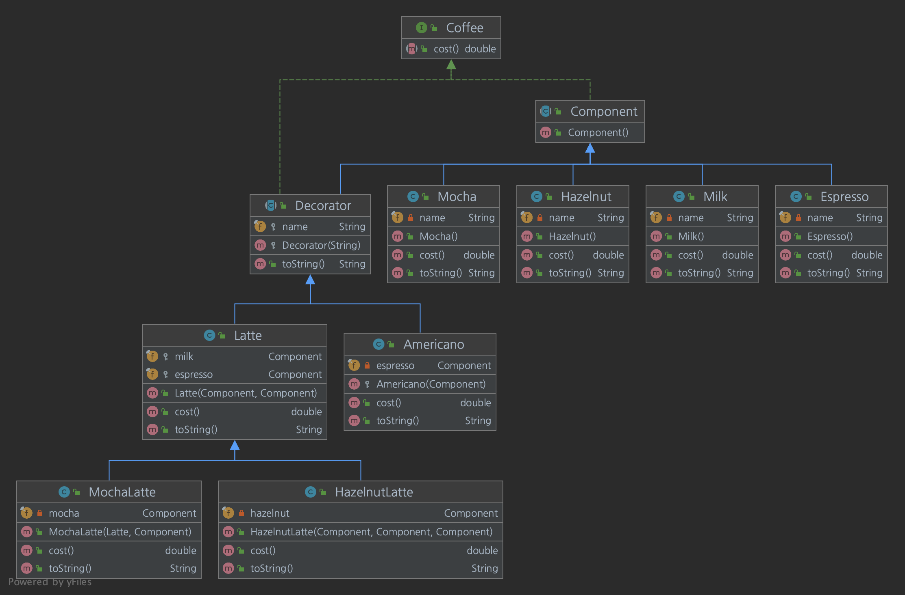

# Decorator Pattern

## Intro

- 데코레이터 패턴을 사용하면 사용자가 구조를 변경하지 않고 기존 개체에 새로운 기능을 추가할 수 있다.
- 기존 클래스에 대한 래퍼 역할을 하므로 구조적 패턴을 따른다.

## 구현 방법

- 기존 클래스를 래핑하고 클래스 메서드 시그니처를 그대로 유지하는 추가 기능을 제공하는 데코레이터 클래스를 작성한다.

## 데코레이션 패턴을 사용할 수 있는 상황

- 객체의 타입과 호출 가능한 메서드를 그대로 유지하면서 객체에 새로운 책임을 추가하려는 경우
- 상속을 통한 서브 클래스를 계속 만드는 것이 비효율적인 경우

## 데코레이터 패턴 적용 시 고려 사항

- `Component`는 `Decorator`을 추가할 베이스가 되는 역할이므로 작게 정의되어야 한다.
	- `component`는 가급적 인터페이스만을 정의한다.
	- `component`는 변수를 가급적 사용하지 않는다.
	- 변수가 필요한 경우 서브 클래스를 이용한다.
	
- 상속 구조를 통해 `Decorator` 와 `Component`가 같은 인터페이스를 갖도록 한다.
	- `Decorator` 로 계속해서 감싸도 `Component` 메서드는 계속해서 사용할 수 있다.

- 구현하려는 내용이 객체의 겉은 변경하려는 것인지 속을 변경하려는 것인지 판단한다.
	- 속을 변경하려는 것이라면 Strategy Pattern 을 선택하여 구현한다.
	
- Decorator 의 구현체가 또 다른 Decorator 에 대해 알아야 할 필요가 있다면 해당 패턴에 적절한지 생각해 봐야 한다.

## 라이브러리의 사례

- 스프링 프레임워크 트랜잭션 처리를 위해 데코레이터 패턴을 사용
