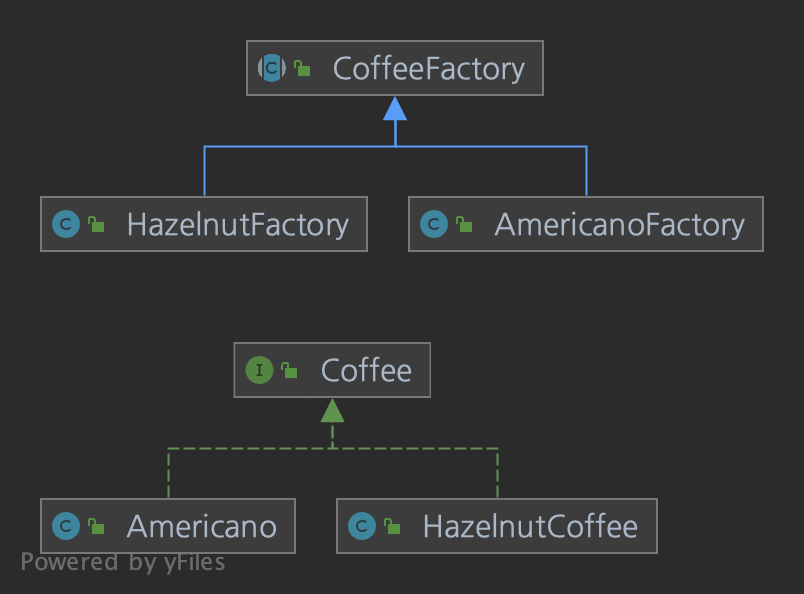

# Factory Pattern

## 팩토리 메서드 패턴을 사용하는 이유

- loose coupling, encapsulation

- Factory
	- Factory Method
	- Simple Factory Method
	- Abstract Factory Method

- 객체의 생성에 대한 책임을 갖는다.

## 객체지향 설계 원칙에 관련된 Factory

- 객체지향 원칙
	- 단일 책임 원칙(Single Responsibility Principle, SRP)
	- 개방-폐쇄 원칙(Open-Close Principle)
	- 의존관계 역전 원칙(Dependency Inversion Principle)

### OCP

- 확장에 열려 있고 변경에 닫혀 있어야 한다는 원칙에 따라 팩토리 클래스는 특정 타입에 따라 객체를 생성한다.

### DIP

- 구체화 클래스에 의존하지 않고 추상 클래스나 인터페이스와 협력해야 한다.

- 팩토리 클래스를 통해 구체화 클래스에 대한 정보를 캡슐화하고 생성을 할 수 있다.

### SRP

- SimpleFactory 는 의존하는 구체 클래스에 대해 결합도가 높다.
- 변하는 요구사항에 따라 지속적으로 추가 될 수 밖에 없다.

- 지속적인 문제에 따라 개선을 위해서는 Abstract Factory Pattern이 필요하다.

## Abstract Factory Pattern

- SimpleFactory 의 문제점을 해결할 수 있는 방법
- 팩토리에서 생성에 대한 책임을 갖고 있는 클래스를 두고, 하위 메서드를 통해 적합한 객체를 생성하도록 하는 방법

## Factory Pattern 맞아?

- DIP 원칙을 엄격하게 따르면 코드 내의 팩토리 클래스를 제외하고 new 키워드를 사용하면 안된다.
	- 점차 확장할 가능성이 있는 단계인 경우 팩토리로 인하여 설계의 확장이 어려워진다.
	- 팩토리를 사용하기 위해서는 클래스를 많이 만들어야 한다.
	- 팩토리 메서드 패턴의 경우 구현 상속을 강제하기 때문에 유지 보수에 문제가 있을 수 있다.

## 예시

- Product
	- Coffee
		- Americano
		- Hazelnut
- Factory

