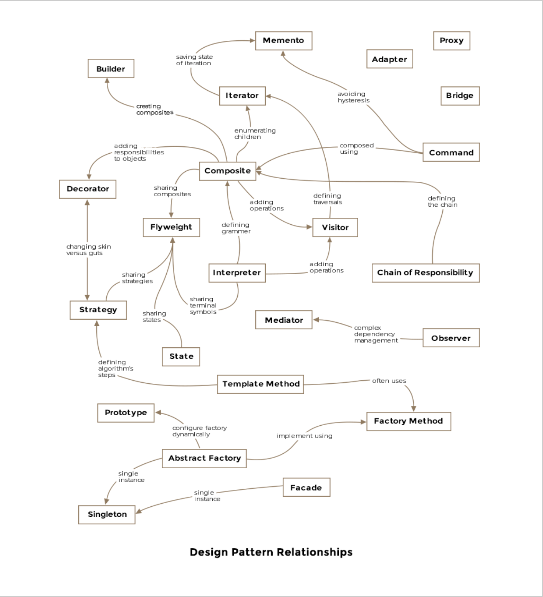

# Intro

## 왜 패턴을 공부해야 할까?

**패턴**이 필요한 이유는 뭘까?

> The blunt answer is we don't want to reinvent the wheel!

* 개발 환경에서 **자주 발생하는 문제**는 일반적으로 유연하고, **모듈화**되고, 이해하기 **쉽게 정의된 솔루션**을 갖고 있다.
* 이러한 솔루션들이 **전술적 세부 사항에서 추상화 되면 디자인 패턴**이 된다.

## 디자인 패턴들 간의 관계

## 객체 지향 설계를 위한 제안

* 동일하게 유지되는 것과 다르거나 변경되는 코드 부분을 분리한다.
* 구체적인 구현을 사용하지 않고, 항상 인터페이스에 코딩한다.
* 행동을 최대한 **캡슐화**해라
* **상속**보다 **합성**을 선호해라, 상속으로 인해 클래스가 급증할 수 있으며 때로는 기본 클래스에 일부 파생 클래스에 적용할 수 없는 새로운 기능이 장착된다.
* 시스템 내에서 상호 작용하는 구성 요소는 가장 느슨하게 연결되어야 한다.
* 이상적으로, 클래스 디자인은 수정을 금지하고 확장을 장려해야 한다.
* 일상적인 작업에서 패턴을 사용하면 공유된 패턴 어휘를 통해 다른 개발자와 전체 구현 개념을 교환할 수 있다.

> 디자인을 유연하고 확장 가능하게 만들면 코드 기반의 **복잡성**과 **이해도**가 높아진다.
>
> 소프트웨어를 설계하고 작성할 때 **두 가지 경쟁 목표 사이에서 경합**해야 한다.

