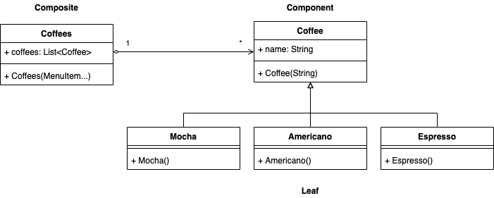

# Composite Pattern

## Intro

- 복합 패턴은 분할 디자인 패턴으로 **동일한 유형의 개체의 단일 인스턴스**와 동일한 방식으로 처리되는 **개체 그룹**을 말한다.
- 복합 패턴의 목적은 개체를 트리 구조로 **구성**하여 부분 전체 계층을 나타내는 것이다.

## 구성 요소

- 구성요소는 컴포지션의 개체 및 하위 구성 요소에 액세스하고 관리하기 위한 인터페이스를 선언한다.
- 모든 클래스에 공통적인 인터페이스에 대한 기본 동작을 적절하게 구현하는 것이다.

- `Leaf`
	- leaf는 컴포지션의 기본 개체에 대한 동작을 정의
	- 컴포지션의 leaf 개체를 나타낸다.

- `Composite`
	- 복합은 하위 구성 요소를 저장하고 구성 요소 인터페이스에서 하위 관련 작업을 구현한다.

- `Client`
	- 클라이언트는 구성 요소 인터페이스를 통해 컴포지션의 개체를 조작한다.

## 적용 가능한 상황

- `client`는 컴포지션 구조의 개체와 상호작용하기 위해서 구성 요소 클래스 인터페이스를 사용한다.
- 수신자가 `leaf`인 경우 요청이 직접 처리된다.
- 수신자가 `composite`인 경우 일반적으로 요청을 하위 구성 요소로 전달하여 전달 전후에 추가 작업을 수행할 수 있다.

## 구현 방법

- 도메인의 핵심 모델이 트리 구조로 표현될 수 있는지 확인하기
	- 단순한 요소와 컨테이너로 나눈다.
	- 컨테이너는 단순 요소와 컨테이너를 모두 포함할 수 있어야 한다.

- 단순 구성 요소와 합성한 구성 요소 모두에 적합한 메서드 목록으로 구성 요소 인터페이스를 선언한다.

- 간단한 요소를 나타내는 리프 클래스를 만든다.

- 복잡한 요소를 나타내는 컨테이너 클래스를 만든다.
	- 이 클래스에서 하위 요소에 대한 참조를 저장하기 위한 배열 필드를 제공한다.
	- 배열은 리프와 컨테이너를 모두 저장할 수 있어야 하므로 구성 요소 인터페이스 유형으로 선언
	- 컴포넌트 인터페이스의 메서드를 구현하는 동안 컨테이너는 대부분의 작업을 하위 요소에 위임해야 한다.

- 컨테이너에서 자식 요소를 추가하고 제거하는 방법을 정의한다.

## 장점과 단점

- 복잡한 트리 구조로 더 편리하게 작업할 수 있다.
	- 다형성과 재귀를 유용하게 사용할 수 있다.

- OCP 원칙에 따라 기존 코드를 손상시키지 않고 앱에 새 요소 유형을 추가할 수 있다.

- 기능이 너무 많이 다른 클래스에 대한 공통 인터페이스를 제공하기 어려운 문제점이 있다.
	- 특정 시나리오에서는 구성 요소 인터페이스를 과도하게 일반화하기가 어렵다.
