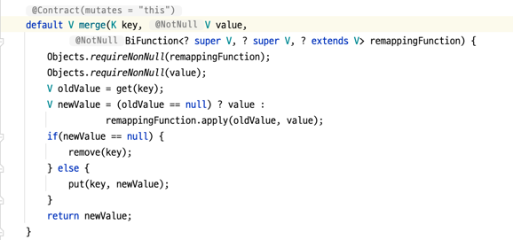

# Item 43

- [Presentation](/java/effective/item43/item43.pdf)

## Intro

- **람다**가 **익명 클래스**보다 나은 점 중에서 가장 큰 특징은 **간결함**이다.
- 보다 더 간결한 방법인 **메서드 레퍼런스(method reference)**가 있다.

## Map.merge()로 보는 람다와 메서드 레퍼런스 차이

- **"임의의 키와 Integer 값의 매핑을 관리하는 프로그램"** 을 작성하는 경우
    - 이때 값이 키의 인스턴스 개수로 해석된다면, 이러한 프로그램을 멀티셋(multiset)을 구현한 방식이라 할 수 있다.
	- 키가 맵 안에 없다면 키와 숫자 1을 매핑하고, 이미 있다면 기존 매핑 값을 증가시킨다.




```java
class Example {
    public static void main(String[] args) {
        // 람다를 사용한 예시
	    map.merge(key, 1, (count, incr) -> count + incr);
	    
	    // 메서드 레퍼런스를 사용한 예시
	    map.merge(key, 1, Integer::sum);
    }
}
```

- **메서드 레퍼런스**를 사용하는 경우 똑같은 결과위해 간결한 코드로 작성할 수 있다.
	- **매개 변수**가 늘어날수록 메서드 참조로 **생략**할 수 있는 코드 양도 늘어난다.
	- 매개변수 이름 자체가 프로그래머에게 좋은 가이드가 되기도 하기 때문에 필요한 경우 람다를 사용한다.
	- 메서드 참조에는 기능을 잘 드러내는 이름을 지어줄 수 있어 친절한 설명을 문서로 남길 수 있다.
	

> 람다로 할 수 없는 일이라면 메서드 레퍼런스로도 할 수 없다. **물론 예외도 존재한다.**

## 람다가 메서드 레퍼런스보다 간결한 경우

- 메서드와 람다가 같은 클래스에 있는 경우에 람다가 더 간결한 코드를 작성할 수 있다.
	- 메서드 레퍼런스는 더 짧지도 명확하지도 않다.

```java
class Example {
    public static void main(String[] args) {
        // 메서드 레퍼런스를 사용하는 경우
	    service.execute(GoshThisClassNameIsHumongous::action);
	    
	    // 람다를 사용하는 경우
	    service.execute(() -> action());
    }
}
```

### 동일한 경우의 자바 API 사례

- java.util.function 패키지가 제공하는 제네릭 정적 팩터리 메서드인 Function.identity()를 사용하는 것보다 람다(x -> x)를 사용하는 것이 더 간결하고 명확하다.

## 메서드 레퍼런스의 유형 5가지

|No|메서드 참조 유형|예|같은 기능을 하는 람다|
|:---:|:---:|:---:|:---:|
|1|**정적 메서드를 가리키는 메서드 참조**|Integer::parseInt|str -> Integer.parseInt(str)|
|2|**인스턴스 메서드를 참조하는 유형 <br/> 수신 객체를 특정하는 한정적 인스턴스 메서드 참조**|Instant.now()::isAfter|Instant then = Instant.now(); <br/> t -> then.isAfter(t)|
|3|**인스턴스 메서드를 참조하는 유형 <br/> 수신 객체를 특정하지 않는 비한정적 인스턴스 메서드 참조**|String::toLowerCase|str -> str.toLowerCase()|
|4|**클래스 생성자를 가리키는 메서드 레퍼런스**|TreeMap<K, V>::new|() -> new TreeMap<K,V>()|
|5|**배열 생성자를 가리키는 메서드 레퍼런스**|int[]::new|len -> new int[len]|

- **한정적 참조**는 근본적으로 정적 참조와 비슷하다.
	- 즉, 함수 객체가 받는 인수와 참조되는 메서드가 받는 인수가 똑같다.
	
- **비한정적 참조**에서는 함수 객체를 적용하는 시점에 수신 객체를 알려준다.
	- 이를 위해 수신 객체 전달용 매개변수가 매개변수 목록의 첫 번째로 추가되며, 그 뒤로는 참조되는 메서드 선언에 정의된 매개변수들이 뒤따른다.
	- 비한정적 참조는 주로 스트림 파이프라인에서의 매핑과 필터 함수에 쓰인다.[아이템 45]()
	
- **생성자 참조**는 팩터리 객체로 사용된다.

## 람다로 불가능하고 메서드 레퍼런스로만 구현 가능한 제네릭 함수 타입(generic function type)

- 함수형 인터페이스의 추상 메서드가 제네릭일 수 있듯이 함수 타입도 제네릭일 수 있다.
- 함수형 인터페이스를 위한 제네릭 함수 타입은 메서드 참조 표현식으로는 구현할 수 있지만, 람다식으로는 불가능하다.
- 제네릭 람다식이라는 문법이 존재하지 않는다.

## 정리

> **메서드 레퍼런스는 람다와 비교 했을 때 짧고 명확한 쪽을 선택하여 사용하라**
